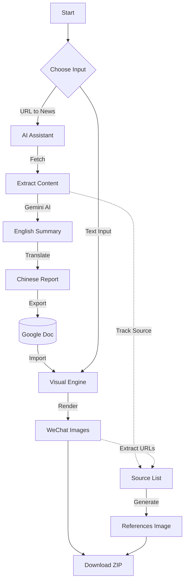

#redeployment test

# Project NEXUS - News Production Studio

Project NEXUS is a comprehensive news production system designed to discover, verify, translate, and visualize news for international student communities. It combines automated discovery agents with a professional **Interactive Studio** web interface for editorial control.

## 🚀 Quick Deploy to Railway

[](https://railway.app/new/template)

### Railway Deployment Steps

1. **Click the "Deploy on Railway" button above** or manually create a new project on [Railway](https://railway.app)
2. **Connect your GitHub repository** to Railway
3. **Set Environment Variables**:
   
   Required:
   ```
   OPENROUTER_API_KEY=sk-or-v1-YOUR_KEY_HERE
   ```
   
   Optional (for advanced features):
   ```
   GOOGLE_API_KEY=YOUR_GOOGLE_API_KEY_FOR_PSE
   CUSTOM_SEARCH_ENGINE_ID=YOUR_GOOGLE_PSE_CX_ID
   TARGET_GOOGLE_DOC_ID=YOUR_GOOGLE_DOCUMENT_ID_HERE
   SECRET_KEY=your-random-secret-key-here
   
   # Cloud Credentials (if not using file-based auth)
   GOOGLE_OAUTH_CREDENTIALS_JSON={...}
   GOOGLE_OAUTH_TOKEN_PICKLE_BASE64=...
   ```

## 🖥️ NEXUS Live Studio (Web Interface)

The core of the system is the **Live Studio**, a modern web interface (`app.py`) for producing WeChat-ready news content.

### Start the Studio
```bash
python app.py
# Access at http://localhost:3000
```

### Production Workflow



### Key Features

#### 1. Task Queue & Real-Time Monitoring
- **Async Processing**: Long-running tasks (fetching, translating, rendering) run in the background.
- **Live Updates**: Server-Sent Events (SSE) provide real-time progress bars and status logs.
- **Sidebar Queue**: View all active and completed tasks, filter by type (Doc/Image) or School.

#### 2. News Production Pipelines

**A. URL to Chinese News (AI Assistant)**
- **Input**: Paste any English news article URL.
- **Process**:
    1.  Fetches and extracts article content.
    2.  **Gemini AI**: Generates an English summary tailored for Chinese readers.
    3.  **Translator**: Translates to formal Chinese news style and auto-generates a title.
    4.  **Export**: Automatically appends the report to the weekly Google Doc.
- **Output**: JSON report and Google Doc entry.

**B. Google Doc to WeChat Images (Visual Engine)**
- **Input**: Auto-detects completed docs from the "URL to News" step, or accepts a manual Google Doc link.
- **Process**:
    1.  Parses the Google Doc for news items.
    2.  Detects school branding (colors/logo) from the title.
    3.  Renders pixel-perfect WeChat-style images using Headless Chromium.
- **Preview**: Built-in image grid with one-click download.

**C. Text to Image (Quick Tool)**
- **Input**: Manual Title + Content entry.
- **Use Case**: Quickly generating an image for a breaking news item without a full article.
- **Features**: Supports custom source URLs and cover images.

**D. Sources Reference Generator**
- **Input**: Auto-collects source URLs from generated images or accepts manual input.
- **Output**: Generates a standardized "Reference" image listing all sources, required for WeChat articles.

### 🎨 School Branding System
The system supports multi-school configurations with distinct visual identities:
- **NYU**: Purple (`#57068c`)
- **USC**: Cardinal (`#990000`)
- **Emory**: Blue (`#222c66`)
- **UC Davis**: Navy/Gold (`#022851`)
- **UBC**: Blue (`#002145`)
- **Edinburgh**: Navy (`#041e42`)

## 📜 Feature Log & History

### [2025-12-29] Interactive Studio v2.0
**Major Web Interface Overhaul (`app.py`, `templates/index.html`)**
- **Architecture**:
    - Replaced synchronous waiting with a **Threaded Task Queue** system.
    - Implemented **SSE (Server-Sent Events)** for sub-second progress updates.
    - Added **Resiliency**: Retry logic and error handling for failed rendering jobs.
- **UI/UX**:
    - **Dark Mode Studio**: Professional "Live Studio" aesthetic with status indicators.
    - **Smart Sidebar**: Persistent task history with school-specific filtering.
    - **Integrated Workflow**: Completed "URL->Doc" tasks automatically appear in the "Doc->Image" queue.
    - **Image Preview**: Modal and grid views for checking generated images before download.
- **Cloud Native**:
    - Added `restore_credentials_from_env()` to support Google OAuth via environment variables (checking `GOOGLE_OAUTH_CREDENTIALS_JSON` and `GOOGLE_OAUTH_TOKEN_PICKLE_BASE64`), eliminating the need for physical files in containerized environments (Railway/Docker).
- **Security**:
    - Path traversal protection in file download endpoints.
    - SSL Certificate monkey-patching for macOS environments.

### [2025-12-20] Rendering Engine Updates
- **Smart Image Discovery**: Automatically fetches cover images from source URL meta tags.
- **Multi-Reference Support**: Tracks all hyperlinks for the sources reference page.
- **`--no-images` Mode**: CLI flag to skip image fetching for faster text-only runs.

### [2025-10-29] Visual Pipeline
- **Google Docs → WeChat Renderer**:
    - Batch renderer for weekly indexes.
    - Robust link parsing (Smart Chips, Tables, TOCs).
    - **UCD Special Styling**: Alternating sidebar colors.

### [2025-09-06] School Expansions
- **UC Davis**: Added category scanners and school config.
- **Emory**: Added combined official/student paper scanners.
- **Edinburgh**: Added crawler for official news and student newspaper.

### [2025-08-20] Core Logic
- **Custom Date Ranges**: `NEWS_START_DATE` support.
- **AI Verification**: Improved prompts for relevance and recency checking.

## 🛠️ Local Development

### Prerequisites
- Python 3.11+
- Chrome/Chromium (for image rendering)
- Google Cloud Project (for Docs API)

### Setup
1. Clone the repo
2. Install dependencies:
   ```bash
   pip install -r requirements.txt
   ```
3. Configure `.env`:
   ```env
   OPENROUTER_API_KEY=...
   ```
4. Run the Studio:
   ```bash
   python app.py
   ```

## 📂 Project Structure

```
NEXUS/
├── app.py                      # Main Flask Studio Application
├── news_bot/                   # Core Logic
│   ├── processing/             # Article fetching & parsing
│   ├── generation/             # Summarization (Gemini)
│   ├── localization/           # Translation & Restyling
│   └── reporting/              # Google Docs Export
├── scripts/                    # Rendering Scripts
│   ├── gdoc_to_wechat_images.py
│   ├── text_to_image.py
│   └── generate_sources_image.py
└── templates/
    └── index.html              # Studio Single Page App
```
